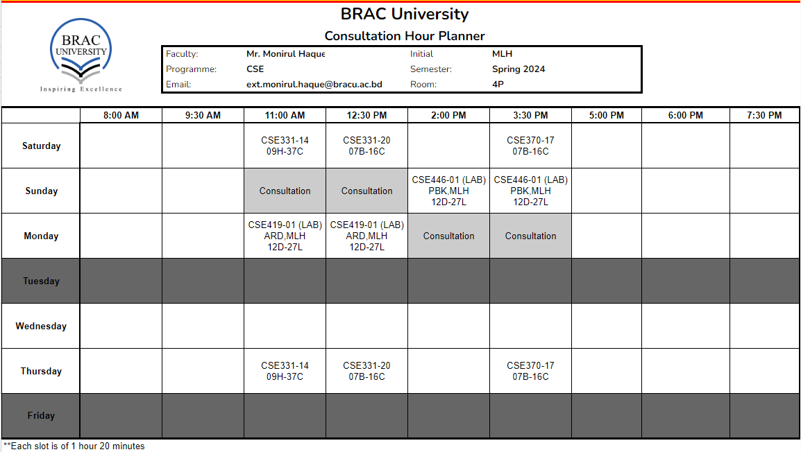
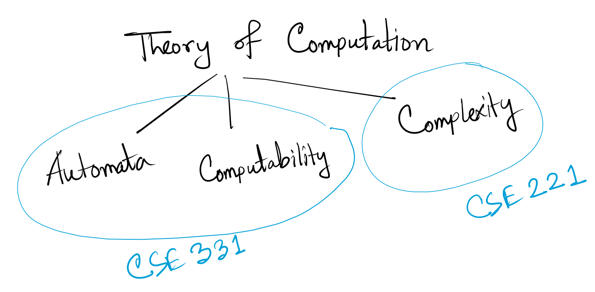
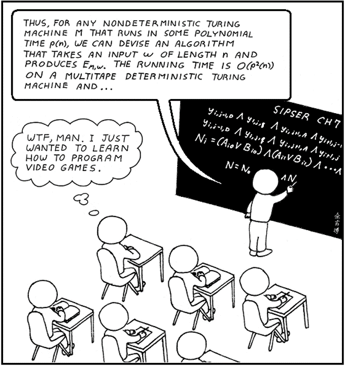
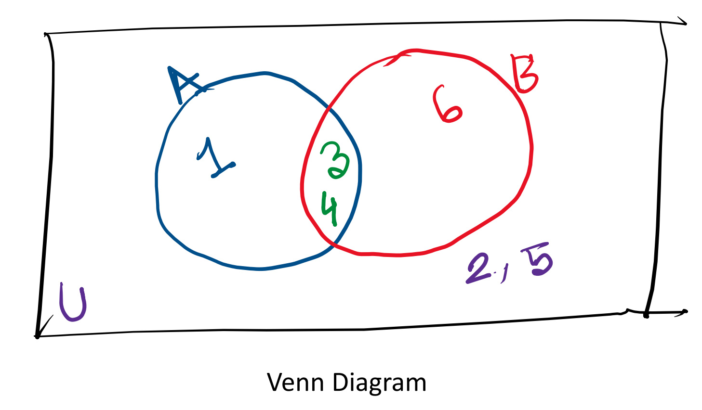
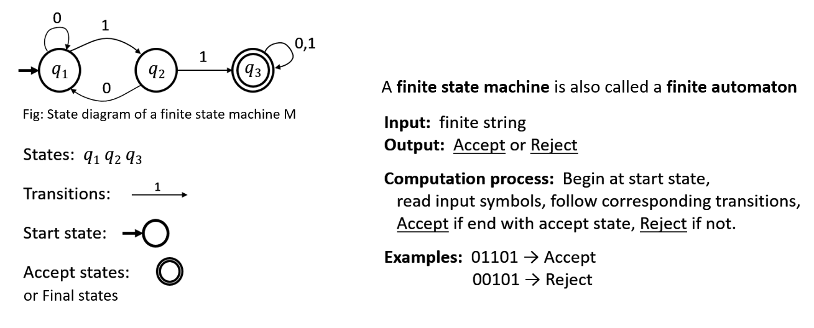
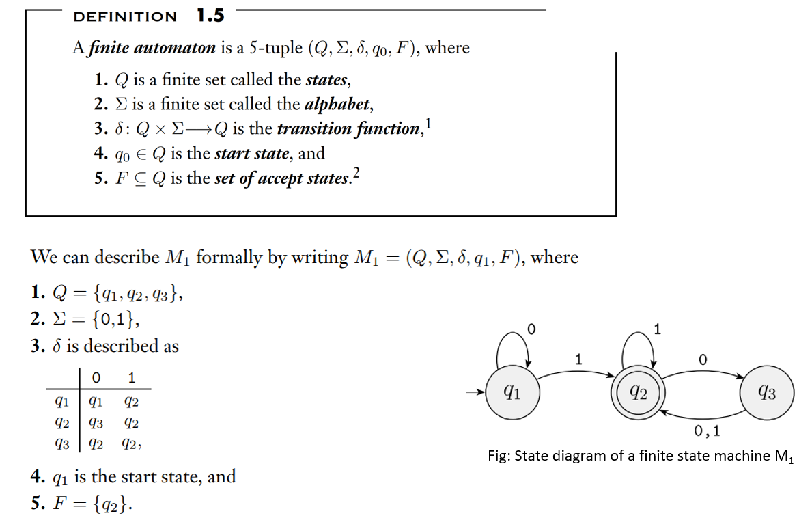

This repository contains all of my lecture contents, practice sheets and other course materials of the course Automata and Computability.

------------------

**Table of Contents**

- [Course Overview](#course-overview)
    - [Course Outline](#course-outline)
    - [Tentative Marks Distribution](#tentative-marks-distribution)
    - [Resources](#resources)
      - [Textbooks](#textbooks)
      - [Other Resources](#other-resources)
    - [Consultation](#consultation)
- [Lecture 1](#lecture-1)
  - [Theory of Computation](#theory-of-computation)
  - [What is Computability theory?](#what-is-computability-theory)
  - [What is Automata theory?](#what-is-automata-theory)
  - [Essential Mathematical Notions and Terminologies](#essential-mathematical-notions-and-terminologies)
    - [Sets and Tuples](#sets-and-tuples)
      - [Subset](#subset)
    - [Strings and Languages](#strings-and-languages)
    - [Regular operations](#regular-operations)
  - [Regular Language and Finite Automata](#regular-language-and-finite-automata)
    - [DFA (Deterministic Finite Automata)](#dfa-deterministic-finite-automata)
    - [Example Problems of Regular Language to DFA](#example-problems-of-regular-language-to-dfa)
- [Lecture 2](#lecture-2)
  - [More Example problems of Regular Language to DFA](#more-example-problems-of-regular-language-to-dfa)
- [Lecture 3](#lecture-3)
  - [Regular Operations Truth Table](#regular-operations-truth-table)
  - [DFA examples with Regular Operations and Cross Product Constructions](#dfa-examples-with-regular-operations-and-cross-product-constructions)
  - [DFA examples with Concatenation and Kleene Closure](#dfa-examples-with-concatenation-and-kleene-closure)
- [Lecture 4](#lecture-4)

# Course Overview
### Course Outline
| Week                                                                       | Theory                                                                                                                                                                                                                | Assessment                                                |
| -------------------------------------------------------------------------- | --------------------------------------------------------------------------------------------------------------------------------------------------------------------------------------------------------------------- | --------------------------------------------------------- |
| Week 1 May 28-30                                                        | Lecture 1: Alphabets, Strings, Languages, and an Introduction to Deterministic Finite Automata (DFA) and Regular Languages.                                                                                           |                                                           |
| Week 2 June 1-6                                                         | Lecture 2: More Examples of DFAs, the Regular Operations.  Lecture 3: Problem Solving on Designing DFAs.                                                                                                        |                                                           |
| Week 3 June 8-13                                                        | Lecture 4: Closure of Regular Languages Under Union: The Cross Product Construction.  Lecture 5: Introduction to Nondeterministic Finite Automata (NFA), Converting NFAs to DFAs using the Subset Construction. |                                                           |
| Week 4 June 15-20 Eid-ul-Adha                                        |                                                                                                                                                                                                                       |                                                           |
| Week 5 June 22-27                                                       | Lecture 6: More Examples of NFAs, Closure of Regular Languages under the Regular Operations.  Lecture 7: Introduction to Regular Expressions, Examples of Regular Expressions.                                  |                                                           |
| Week 6 June 29-July 4                                                   | Lecture 8: More Examples of Regular Expressions, Converting Regular Expressions to NFAs.  Quiz 1 (DFAs and the Regular Operations) and Discussion.                                                           | Quiz 1 (DFAs, the Regular Operations)                     |
| Week 7 July 6-11                                                        | Lecture 9: Converting DFAs to Regular Expressions using State Elimination.  Quiz 2 (Regular Expressions, their equivalence with DFAs), and Discussion.                                                          | Quiz 2 (Regular Expressions, their equivalence with DFAs) |
| Midterms Week July 12-21 Midterm Exam: Date (Time)                   |                                                                                                                                                                                                                       | Midterm Exam: Date (Time)                                 |
| Week 8 July 22-25                                                       | Lecture 10: Nonregular Languages, the Pumping Lemma for Regular Languages.  \* One Extra Day for Monday Schedule [August 26 makeup]                                                                             |                                                           |
| Week 9 July 27-August 1                                                 | Lecture 11: Introduction to Context-Free Grammars (CFG) and Context-Free Languages (CFL).  Lecture 12: CFGs continued, Parse Trees, Derivations, and Ambiguities.                                               |                                                           |
| Week 10 August 3-8                                                   | Lecture 13: Designing CFGs and Discussion.  Quiz 3 (Context-Free Grammars) and Discussion.                                                                                                                      | Quiz 3 (Context-Free Grammars)                            |
| Week 11 August 10-15  August 15: National Mourning Day (Thursday) | Lecture 14: Putting a Grammar into Chomsky Normal Form.  Lecture 15: The Cocke-Younger-Kasami Algorithm.                                                                                                        |                                                           |
| Week 12 August 17-22                                                 | Lecture 16: Introduction to Pushdown Automata (PDA)  Lecture 17: Designing PDAs and Examples.                                                                                                                   |                                                           |
| Week 13 August 14-29  August 26: Janmashtami (Monday)             | Lecture 18: More PDAs and Review  Quiz 4 (CNF, CYK, and PDAs)                                                                                                                                                   | Quiz 4 (CNF, CYK, and PDAs)                               |
| Finals Week August 31- September 8 Final Exam: Date                  |                                                                                                                                                                                                                       | Final Exam Time Date                                |
### Tentative Marks Distribution
| Marks Distribution     | %  |
| ---------------------- | -- |
| Assignments            | 10 |
| Quiz (Best 3 out of 4) | 20 |
| Surprise Test (3-4)    | 5  |
| Mid                    | 30 |
| Final                  | 35 |

### Resources
#### Textbooks
- Sipser, M. ***Introduction to the Theory of Computation.*** [Link](https://drive.google.com/file/d/1Ec1lv0JcvMVUVyQ2Cq9EbsAVatoZSpMC/view?usp=drive_link)
- Hopcroft, J., R. Motwani and J.D. Ullman *Introduction to automata theory, languages and computation.* [Link](https://drive.google.com/file/d/1TmGgNfuc97OqM3BYJSRtz1qDKX81iy2-/view?usp=drive_link)
- Kozen, D.C. *Automata and Computability*. [Link](https://vishub.org/officedocs/13770.pdf)
#### Other Resources
- **[Mursalin Sir's Class Recordings](https://drive.google.com/drive/folders/1PtQaX_Sn47wt11GPSp-7TkgrNdwYvHwV?usp=drive_link)**
- **[Farhan Feroz Sir's Youtube Playlist](https://www.youtube.com/playlist?list=PLBENQsMXh3gz85EJ3ZCSa9l9hnUiOer-H)**
- [MIT Micheal Sipser's Lectures](https://www.youtube.com/playlist?list=PLUl4u3cNGP60_JNv2MmK3wkOt9syvfQWY) {writer of the Text book we follow} (First 4 Lectures only)
- [Easy Theory Youtube Channel](https://www.youtube.com/@EasyTheory/featured)
- [University of California Davis Lectures](https://www.youtube.com/playlist?list=PLslgisHe5tBM8UTCt1f66oMkpmjCblzkt)
- [CS103 Stanford University Lecture Slides](https://web.stanford.edu/class/archive/cs/cs103/cs103.1184/)
- [Professor Harry Potters Playlist](https://www.youtube.com/playlist?list=PLbtzT1TYeoMjNOGEiaRmm_vMIwUAidnQz)
- [Anisul Islam's Playlist](https://www.youtube.com/playlist?list=PLgH5QX0i9K3qw5pu16QgnKNj91Rnjoyd0)

### Consultation

  

# Lecture 1
## Theory of Computation
Theory of Computation deals with the fundamental mathematical properties of computer hardware, software, and certain applications. In researching this topic, we want to know what can and cannot be computed, how quickly, with how much memory, and on what type of computational model. Traditionally the central three areas of Theory of Computation are: automata, computability, and complexity.

  

I know some of you might be interested in mathematical stuffs but some of you here are out of choice. You may just want to obtain a degree in Computer Science, and a course in theory is required—God knows why. After all, isn’t theory arcane, boring, and worst of all, irrelevant?
Well, theory can be sometimes boring and tiresome but it is fun to solve Automata problems (you'll see shortly).

  

Also, theory is not totally irrelevant and useless. Here's an idea of how the theory you learn here will be of useful for you in practice:
* Designing a new programming language for a specialized application? 
  You need **Context free grammar (CFG)**.
* Dealing with string searching and pattern matching? 
   You need **finite automata (DFA, NFA)** and **regular expressions** (Example: python regex)
* You want to do Parts of Speech (POS) Tagging in Natural Language Processing (NLP)?
   You need **CFG, Chomsky normal form,  parsing trees, Cocke–Younger–Kasami algorithm (CYK)** etc.
* Markov chains are probabilistic counterpart of finite automata.

If you think you will not work on any of those use cases, solving Automata can increase your problem solving skills as  .So, let's start learning.

## What is Computability theory?
Have you noticed that computer can not determine whether a mathematical statement is true or false? Similarly, there are countless mathematical functions that can not be computed by the computer.  
In mathematical theory a lot of problems can be solved but in computability theory we prove whether these problems can be solved using computer or not. Basically, Computability is a subject where we  study and prove what the fundamental capabilities & limitations of computers are.

## What is Automata theory?
Automata is the definitions and properties of mathematical models of computation. It is the study of abstract machines/computers. An automaton is an abstract computer/machine.  
Automata theory has applications in programming language design, compiler construction, text processing, software verification, and natural language processing etc.

## Essential Mathematical Notions and Terminologies
### Sets and Tuples
* A set is a group of objects represented as a unit. Example: S = {7, 21, 57}      
* Those objects are called elements or members of that set.

A set of Natural Numbers, N = {1, 2, 3…}	[Often 0 is considered Natural too]  
A set of Integers, Z = {…-3, -2, -1, 0, 1, 2, 3…}	 
A set of Real Numbers, R = {…-3, … , -2.5, … , 0, …, 1.12957…}  
The set with zero members is called the empty set and is written ∅.  
A set with two members is called an unordered pair.  

Example of a set,  
S = {n| n = m2 for some m ∈ N} 	 
   = {1, 4, 9, 16...}		 			
Here, **|** symbol means **"such that"** and **∈** means **"element of"** or **"belongs to"**.               
We can write, 7 ∈ {7, 21, 57} and 8 ∉ {7, 21, 57}   

* Elements order does not matter in sets.
* Finite Sequences are called tuples. Example: (7, 21, 57)
* A set can contain tuples for example, S = {(a, b), (1, c)}

#### Subset
* A is a subset of B, written A ⊆ B, if every member of A also is a member of B.   
* A is a proper subset of B, written A⊂B, if A is a subset of B and not equal to B.  
Example: 
If  A = {1, 2, 3}; 	B = {1, 2, 3}    Then, A ⊆ B  and A⊂B  
If  A = {1, 2}; 	B = {1, 2, 3}    Then, A ⊆ B  and A⊂B  

### Strings and Languages
* Symbol: a character
  Example: a, c, Z, 0, 9, α, ক
* Alphabet: a finite set of symbols 
  *We generally use capital Greek letters capital sigma Σ or capital gamma Γ to designate alphabets*
* String: a finite sequence of symbols over an alphabet set. 
  *An empty string is represented using epsilon, ε*
  *Any part of a string is called substring*
* Language: a set of strings
Example: 
Σ = {0,1} 			
01001 is a string over Σ   		
{0, 01, 10, 01001} is a language over Σ  

### Regular operations
Suppose, 
A = {1, 3, 4}	  
B = {3, 4, 6}   
Universal set, U = {1, 2, 3, 4, 5, 6}

  

 
**Compliment** of A = **A̅**= {2, 5, 6}
**Union** of A and B = **A ∪ B** = {1, 3, 4, 6}
**Intersection** of A and B = **A ∩ B** = {3, 4}

Suppose,
String P = "Bangla"
String Q = "desh"

**Concatanation** of P and Q = **P◦Q** = {xy| x ∈ P and y ∈ Q} = "Bangladesh"
**Kleene Closure** of Q = Q* = {x1x2 . . . xk| k ≥ 0 and each xi ∈ Q} = ε, desh, deshdesh, deshdeshdesh...

## Regular Language and Finite Automata
* Finite automata are mathematical models for computers with an extremely limited amount of memory.
* Automata is a plural form of Automaton. So, a single model is called a finite automaton or a finite state machine.
* A language is called a regular language if some finite automaton recognizes it.

Regular Language for the given automaton should be,  
<b>L = {w ∈ {0, 1}* | w has a substring 11}</b>

  
  <i>Source: MIT Lecture of Micheal Sipson</i>

  
  <i>Source: Micheal Sipson' book page 35-36</i>

Types of finite automata: 
- Deterministic finite automata **(DFA)** 
- Non-deterministic finite automata **(NFA)**

The example we saw above is a DFA.

### DFA (Deterministic Finite Automata)
* A DFA accepts or rejects an input string based on whether a regular language reaches a final/accept state or not. 
* From each state a transition leads to a unique state.

* What we can’t do in DFA design:
  * Multiple starting states (Remember it can have multiple accept states)
  * Empty/null/epsilon (ε) transitions
  * Multiple different transitions for a single symbol
  * Any state with no transitions or partial transitions

  
  

Don't get overwhelmed already. If you are confused, no problem at all. We’ve wrapped up the theoretical stuff, and now it’s time for the fun part! We will dive into some examples and do some practices now and also in the next few classes. You will understand everything eventually.

### Example Problems of Regular Language to DFA

L1 = {w ∈ {0, 1}*| w ends with a 1}

 

  Notice here, this language set contains strings such as 1, 01, 001, 101, 111, 0101, ...  
  

L2 = {w ∈ {0, 1}*| w does not end with a 1}

 

  Notice the language of L1 and L2. L2 is actually compliment set of L1. Now Notice the DFA's of both languages; they are the same DFA's except the accept state. 
  If you have designed a DFA for a language, you can easily create a DFA for its complement set. The states that were previously accept states, will not be accept states anymore and the states that were not accept state before will become accept sates now.
  

  

# Lecture 2

## More Example problems of Regular Language to DFA

L3 = {w ∈ {0, 1}*| w has odd number of 1's}

 

  

L4 = {w ∈ {0, 1}*| w has even number of 1's}

 

  Notice that L4 is complement of the language set L3  
  

L5 = {w ∈ {0, 1}*| w has substring 11}

 

  

L6 = {w ∈ {0, 1}*| w has substring 001}

 

  

L7 = {w ∈ {0, 1}*| contains at least one 1 and even number of 0’s follow the last 1}

 

  

L8 = {w ∈ {a, b}*| w starts and ends with a or w starts and ends with b }

 

  

L9 = {w ∈ {0, 1}*| w starts with 1}

 

  Notice that, we are transitioning to q3 when we are getting 0 at the beginning of the string. After getting 0 at the beginning of the string there is no way the sentence is going to be accecpted. So, q3 is acting like a <b>Trap state</b> or <b>Dead state</b> here. After transitioning to these kind of states there is no way to go to the accept state.  
  

L10 = {w ∈ {0, 1}*| w starts with 1 and ends with 0}

 

  

L11 = {w ∈ {0, 1}*| length of w is two}

 

  

L12 = {w ∈ {0, 1}*| length of w is at least two}

 

  

L13 = {w ∈ {0, 1}*| length of w is at most two}

 

  

L14 = {w ∈ {0, 1}*| w has even length}

 

  

L15 = {w ∈ {0, 1}*| w has odd length}

 

  

L16 = {w ∈ {0, 1}*| length of w is multiple of 2}

 

  

  

# Lecture 3

## Regular Operations Truth Table

  

For AND, OR and XOR operations we need to learn Cross Product Constructions of DFA

## DFA examples with Regular Operations and Cross Product Constructions

L17 = {w ∈ {0, 1}*| w has 1}

 

  

L18 = {w ∈ {0, 1}*| w ends with 01}

 

  

L19 = L̅18

 

  

L20 = L17 ∩ L18

 

  
For this kind of question we can do cross productions in DFAs to create a new DFA. When we apply cross production between two DFAs (Suppose D1 and D2). The number of states in the new DFA will be, (number of states in D1 * number of states in D2). In our example we have 2 states in L17 and 3 states in L18; so, the cross production will have 3*2 = 6 states. 

  
In L17 From A state the transition of 0 goes to A and in L18 From X state the transition of 0 goes to Y. So, from the new state AX the transition of 0 will go to AY. Similarly, we fillup the transition table.

  

In L17 start state was A and in L18 start state is X. So, the new Start state will be AX. 

For final state,  
In AND/Intersection (∩), only the states in Cross Product Construction DFA that contain the name of the final state of the both DFAs. In this case, final state should be <b>BZ</b> as the name BZ has both B and Z in the name.  
In OR/Union (U), only the states in Cross Product Construction DFA that contain the name of the final state of any of the previous DFAs. In this case, final state should be <b>AZ, BZ, BX, BY</b> as all the states have either B or Z in their names.  
In XOR (⊕), We will just keep the final states of OR but we will get rid of the final states of AND. So, for this cross production the final states should be, <b>AZ, BX, BY</b>. 

  

L21 = L17 U L18

 

  

L22 = L17 ⊕ L18

 

  

## DFA examples with Concatenation and Kleene Closure

L23 = {w ∈ {0, 1}*| 0n where n >= 0}

 

  

L24 = {w ∈ {0, 1}*| 1m where m is odd}

 

  

L25 = L23 ◦ L24 

 

In other words, the question means L25 = {w ∈ {0, 1}*| 0n1m where n >=0 and m is odd}

  

L26 = {w ∈ {0, 1}*| w is 01}

 

  

L27 = L26*

 

  

   

# Lecture 4
To be added
