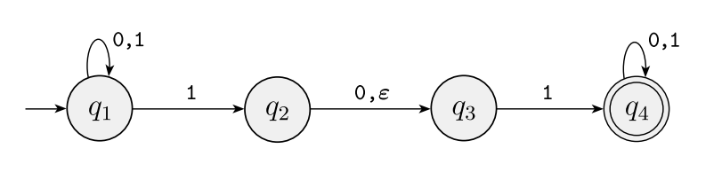
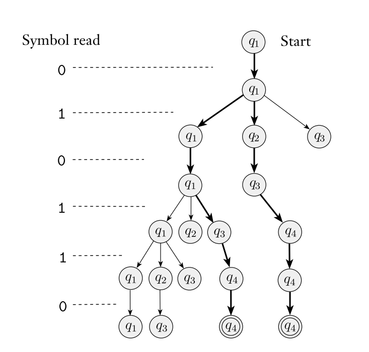
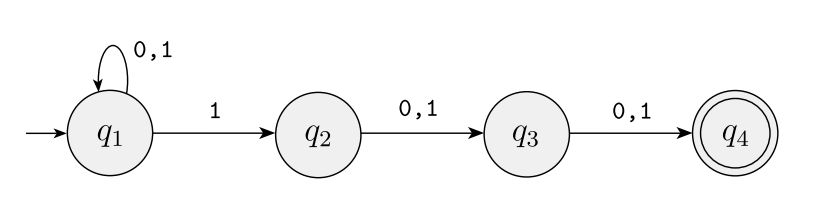
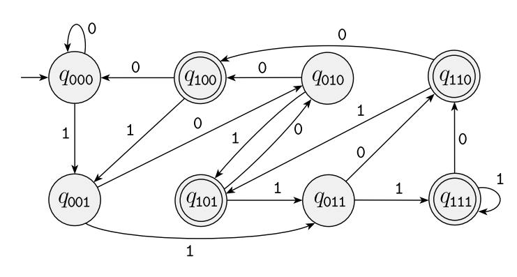
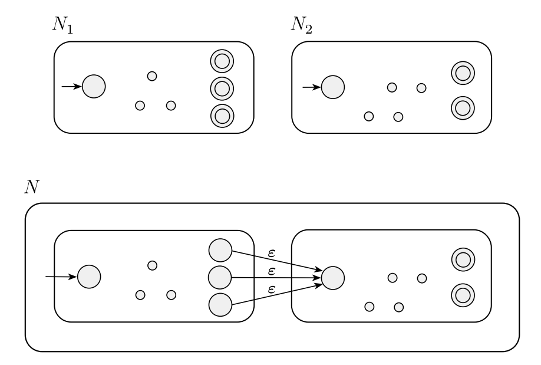
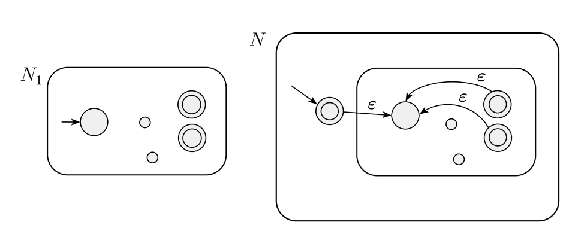

This repository contains all of my lecture contents, practice sheets and other course materials of the course Automata and Computability. </br>

Note that, </br>
- You might still need to attend classes to fully understand the thought process behind the solutions
- You can click on the examples to view the solutions

------------------

**Table of Contents**


- [Course Overview](#course-overview)
    - [Course Outline](#course-outline)
    - [Tentative Marks Distribution](#tentative-marks-distribution)
    - [Resources](#resources)
      - [Textbooks](#textbooks)
      - [Other Resources](#other-resources)
    - [Consultation](#consultation)
- [Lecture 1](#lecture-1)
  - [Theory of Computation](#theory-of-computation)
  - [What is Computability theory?](#what-is-computability-theory)
  - [What is Automata theory?](#what-is-automata-theory)
  - [Essential Mathematical Notions and Terminologies](#essential-mathematical-notions-and-terminologies)
    - [Sets and Tuples](#sets-and-tuples)
      - [Subset](#subset)
    - [Strings and Languages](#strings-and-languages)
    - [Regular operations](#regular-operations)
  - [Regular Language and Finite Automata](#regular-language-and-finite-automata)
    - [DFA (Deterministic Finite Automata)](#dfa-deterministic-finite-automata)
    - [Example Problems of Regular Language to DFA](#example-problems-of-regular-language-to-dfa)
- [Lecture 2](#lecture-2)
  - [More Example problems of Regular Language to DFA](#more-example-problems-of-regular-language-to-dfa)
- [Lecture 3](#lecture-3)
  - [Regular Operations Truth Table](#regular-operations-truth-table)
  - [DFA examples with Regular Operations and Cross Product Constructions](#dfa-examples-with-regular-operations-and-cross-product-constructions)
  - [DFA examples with Concatenation and Kleene Closure](#dfa-examples-with-concatenation-and-kleene-closure)
- [Lecture 4](#lecture-4)
  - [NFA (Non-deterministic Finite Automata)](#nfa-non-deterministic-finite-automata)
    - [How Does An NFA Machine Accept Strings?](#how-does-an-nfa-machine-accept-strings)
    - [Why Do We Need NFA?](#why-do-we-need-nfa)
    - [NFA Examples](#nfa-examples)
- [Lecture 5](#lecture-5)
  - [More NFA Examples](#more-nfa-examples)
- [Lecture 6](#lecture-6)
  - [NFA to DFA](#nfa-to-dfa)
    - [ε-NFA to NFA to DFA](#ε-nfa-to-nfa-to-dfa)
      - [ε-NFA to NFA](#ε-nfa-to-nfa)
      - [NFA to DFA After Conversion](#nfa-to-dfa-after-conversion)
- [Lecture 7](#lecture-7)
  - [Regular Expression](#regular-expression)
    - [Examples of Regular Language to Regular Expression](#examples-of-regular-language-to-regular-expression)
- [Lecture 8](#lecture-8)
  - [DFA to Regular Expression (State Elimiation Method)](#dfa-to-regular-expression-state-elimiation-method)
      - [Scenerios While Elimination](#scenerios-while-elimination)
        - [Scenerio 1: 01\*0](#scenerio-1-010)
        - [Scenerio 2: multiple in out from the state we are eliminating](#scenerio-2-multiple-in-out-from-the-state-we-are-eliminating)
        - [Scenerio 3: merging multiple transitions into one](#scenerio-3-merging-multiple-transitions-into-one)
        - [Scenerio 4: Commas in transitions](#scenerio-4-commas-in-transitions)
        - [Scenerio 5: multiple self loops](#scenerio-5-multiple-self-loops)
        - [Scenerio 6: Trap/Dead State](#scenerio-6-trapdead-state)
        - [Scenerio 7: loop from state to state](#scenerio-7-loop-from-state-to-state)
    - [Example](#example)
- [Lecture 9](#lecture-9)
  - [Regular Expression to NFA (Thompson's Construction)](#regular-expression-to-nfa-thompsons-construction)
    - [Scenerios while building NFA from a regular expression](#scenerios-while-building-nfa-from-a-regular-expression)
      - [Scenerio 1: Concatenation](#scenerio-1-concatenation)
      - [Scenerio 2:  Kleene Closure](#scenerio-2--kleene-closure)
      - [Scenerio 3: OR](#scenerio-3-or)
    - [Example](#example-1)

# Course Overview
### Course Outline
| Week                                                                       | Theory                                                                                                                                                                                                                | Assessment                                                |
| -------------------------------------------------------------------------- | --------------------------------------------------------------------------------------------------------------------------------------------------------------------------------------------------------------------- | --------------------------------------------------------- |
| Week 1<br>May 28-30                                                        | Lecture 1: Alphabets, Strings, Languages, and an Introduction to Deterministic Finite Automata (DFA) and Regular Languages.                                                                                           |                                                           |
| Week 2<br>June 1-6                                                         | Lecture 2: More Examples of DFAs, the Regular Operations.<br><br>Lecture 3: Problem Solving on Designing DFAs.                                                                                                        |                                                           |
| Week 3<br>June 8-13                                                        | Lecture 4: Closure of Regular Languages Under Union: The Cross Product Construction.<br><br>Lecture 5: Introduction to Nondeterministic Finite Automata (NFA), Converting NFAs to DFAs using the Subset Construction. |                                                           |
| Week 4<br>June 15-20<br>Eid-ul-Adha                                        |                                                                                                                                                                                                                       |                                                           |
| Week 5<br>June 22-27                                                       | Lecture 6: More Examples of NFAs, Closure of Regular Languages under the Regular Operations.<br><br>Lecture 7: Introduction to Regular Expressions, Examples of Regular Expressions.                                  |                                                           |
| Week 6<br>June 29-July 4                                                   | Lecture 8: More Examples of Regular Expressions, Converting Regular Expressions to NFAs.<br><br>Quiz 1 (DFAs and the Regular Operations) and Discussion.<br>                                                          | Quiz 1 (DFAs, the Regular Operations)                     |
| Week 7<br>July 6-11                                                        | Lecture 9: Converting DFAs to Regular Expressions using State Elimination.<br><br>Quiz 2 (Regular Expressions, their equivalence with DFAs), and Discussion.                                                          | Quiz 2 (Regular Expressions, their equivalence with DFAs) |
| Midterms Week<br>July 12-21<br>Midterm Exam: Date (Time)                   |                                                                                                                                                                                                                       | Midterm Exam: Date (Time)                                 |
| Week 8<br>July 22-25                                                       | Lecture 10: Nonregular Languages, the Pumping Lemma for Regular Languages.<br><br>\* One Extra Day for Monday Schedule [August 26 makeup]                                                                             |                                                           |
| Week 9<br>July 27-August 1                                                 | Lecture 11: Introduction to Context-Free Grammars (CFG) and Context-Free Languages (CFL).<br><br>Lecture 12: CFGs continued, Parse Trees, Derivations, and Ambiguities.                                               |                                                           |
| Week 10<br>August 3-8<br>                                                  | Lecture 13: Designing CFGs and Discussion.<br><br>Quiz 3 (Context-Free Grammars) and Discussion.                                                                                                                      | Quiz 3 (Context-Free Grammars)                            |
| Week 11<br>August 10-15<br><br>August 15: National Mourning Day (Thursday) | Lecture 14: Putting a Grammar into Chomsky Normal Form.<br><br>Lecture 15: The Cocke-Younger-Kasami Algorithm.                                                                                                        |                                                           |
| Week 12<br>August 17-22<br>                                                | Lecture 16: Introduction to Pushdown Automata (PDA)<br><br>Lecture 17: Designing PDAs and Examples.                                                                                                                   |                                                           |
| Week 13<br>August 14-29<br><br>August 26: Janmashtami (Monday)             | Lecture 18: More PDAs and Review<br><br>Quiz 4 (CNF, CYK, and PDAs)                                                                                                                                                   | Quiz 4 (CNF, CYK, and PDAs)                               |
| Finals Week<br>August 31- September 8<br>Final Exam: Date                  |                                                                                                                                                                                                                       | Final Exam<br>Time<br>Date                                |
### Tentative Marks Distribution
| Marks Distribution     | %  |
| ---------------------- | -- |
| Assignments            | 10 |
| Quiz (Best 3 out of 4) | 20 |
| Surprise Test (3-4)    | 5  |
| Mid                    | 30 |
| Final                  | 35 |

### Resources
#### Textbooks
- Sipser, M. ***Introduction to the Theory of Computation.*** [Link](https://drive.google.com/file/d/1Ec1lv0JcvMVUVyQ2Cq9EbsAVatoZSpMC/view?usp=drive_link)
- Hopcroft, J., R. Motwani and J.D. Ullman *Introduction to automata theory, languages and computation.* [Link](https://drive.google.com/file/d/1TmGgNfuc97OqM3BYJSRtz1qDKX81iy2-/view?usp=drive_link)
- Kozen, D.C. *Automata and Computability*. [Link](https://vishub.org/officedocs/13770.pdf)
#### Other Resources
- **[Kabbya Sir's Class Recordings](https://www.youtube.com/playlist?list=PLib4rFadvfrckeiUjBjYWnxtyUmW5-X8r)** {Classes after mid}
- **[Mursalin Sir's Class Recordings](https://drive.google.com/drive/folders/1PtQaX_Sn47wt11GPSp-7TkgrNdwYvHwV?usp=drive_link)**
- **[Farhan Feroz Sir's Youtube Playlist](https://www.youtube.com/playlist?list=PLBENQsMXh3gz85EJ3ZCSa9l9hnUiOer-H)**
- [MIT Micheal Sipser's Lectures](https://www.youtube.com/playlist?list=PLUl4u3cNGP60_JNv2MmK3wkOt9syvfQWY) {writer of the Text book we follow} (First 4 Lectures only)
- [Easy Theory Youtube Channel](https://www.youtube.com/@EasyTheory/featured)
- [University of California Davis Lectures](https://www.youtube.com/playlist?list=PLslgisHe5tBM8UTCt1f66oMkpmjCblzkt)
- [CS103 Stanford University Lecture Slides](https://web.stanford.edu/class/archive/cs/cs103/cs103.1184/)
- [Professor Harry Potters Playlist](https://www.youtube.com/playlist?list=PLbtzT1TYeoMjNOGEiaRmm_vMIwUAidnQz)
- [Anisul Islam's Playlist](https://www.youtube.com/playlist?list=PLgH5QX0i9K3qw5pu16QgnKNj91Rnjoyd0)

*Also Check out the [Resources](Resources/README.md) for some awesome tools*

### Consultation

<p align="center">
  
</p>

# Lecture 1
Date: 
## Theory of Computation
Theory of Computation deals with the fundamental mathematical properties of computer hardware, software, and certain applications. In researching this topic, we want to know what can and cannot be computed, how quickly, with how much memory, and on what type of computational model. Traditionally the central three areas of Theory of Computation are: automata, computability, and complexity.

<p align="center">
  
</p>

I know some of you might be interested in mathematical stuffs but some of you here are out of choice. You may just want to obtain a degree in Computer Science, and a course in theory is required—God knows why. After all, isn’t theory arcane, boring, and worst of all, irrelevant?
Well, theory can be sometimes boring and tiresome but it is fun to solve Automata problems (you'll see shortly).

<p align="center">
  
</p>

Also, theory is not totally irrelevant and useless. Here's an idea of how the theory you learn here will be of useful for you in practice:
* Designing a new programming language for a specialized application? 
  You need **Context free grammar (CFG)**.
* Dealing with string searching and pattern matching? 
   You need **finite automata (DFA, NFA)** and **regular expressions** (Example: python regex)
* You want to do Parts of Speech (POS) Tagging in Natural Language Processing (NLP)?
   You need **CFG, Chomsky normal form,  parsing trees, Cocke–Younger–Kasami algorithm (CYK)** etc.
* Markov chains are probabilistic counterpart of finite automata.

If you think you will not work on any of those use cases, solving Automata can increase your problem solving skills as  .So, let's start learning.

## What is Computability theory?
Have you noticed that computer can not determine whether a mathematical statement is true or false? Similarly, there are countless mathematical functions that can not be computed by the computer. </br>
In mathematical theory a lot of problems can be solved but in computability theory we prove whether these problems can be solved using computer or not. Basically, Computability is a subject where we  study and prove what the fundamental capabilities & limitations of computers are.

## What is Automata theory?
Automata is the definitions and properties of mathematical models of computation. It is the study of abstract machines/computers. An automaton is an abstract computer/machine. </br>
Automata theory has applications in programming language design, compiler construction, text processing, software verification, and natural language processing etc.

## Essential Mathematical Notions and Terminologies
### Sets and Tuples
* A set is a group of objects represented as a unit. Example: S = {7, 21, 57}      
* Those objects are called elements or members of that set.

A set of Natural Numbers, N = {1, 2, 3…}	[Often 0 is considered Natural too] </br>
A set of Integers, Z = {…-3, -2, -1, 0, 1, 2, 3…}	</br>
A set of Real Numbers, R = {…-3, … , -2.5, … , 0, …, 1.12957…} </br>
The set with zero members is called the empty set and is written ∅. </br>
A set with two members is called an unordered pair. </br>

Example of a set, </br>
S = {n| n = m<sup>2</sup> for some m ∈ N} 	</br>
   = {1, 4, 9, 16...}		</br>			
Here, **|** symbol means **"such that"** and **∈** means **"element of"** or **"belongs to"**.    </br>          
We can write, 7 ∈ {7, 21, 57} and 8 ∉ {7, 21, 57}  </br>

* Elements order does not matter in sets.
* Finite Sequences are called tuples. Example: (7, 21, 57)
* A set can contain tuples for example, S = {(a, b), (1, c)}

#### Subset
* A is a subset of B, written A ⊆ B, if every member of A also is a member of B.  </br>
* A is a proper subset of B, written A⊂B, if A is a subset of B and not equal to B. </br>
Example: 
If  A = {1, 2, 3}; 	B = {1, 2, 3}    Then, A ⊆ B  and A⊄B </br>
If  A = {1, 2}; 	B = {1, 2, 3}    Then, A ⊆ B  and A⊂B </br>

### Strings and Languages
* Symbol: a character </br>
  Example: a, c, Z, 0, 9, α, ক
* Alphabet: a finite set of symbols </br>
  *We generally use capital Greek letters capital sigma Σ or capital gamma Γ to designate alphabets*
* String: a finite sequence of symbols over an alphabet set. </br>
  *An empty string is represented using epsilon, ε* </br>
  *Any part of a string is called substring* 
* Language: a set of strings 
Example: </br>
Σ = {0,1} </br>			
01001 is a string over Σ </br>  		
{0, 01, 10, 01001} is a language over Σ  

### Regular operations
Suppose, </br>
A = {1, 3, 4} </br>	  
B = {3, 4, 6} </br>   
Universal set, U = {1, 2, 3, 4, 5, 6}

<p align="center">
  
</p>
 
**Compliment** of A = **A̅**= {2, 5, 6} </br>
**Union** of A and B = **A ∪ B** = {1, 3, 4, 6} </br>
**Intersection** of A and B = **A ∩ B** = {3, 4}

Suppose, </br>
String P = "Bangla" </br>
String Q = "desh" </br>

**Concatanation** of P and Q = **P◦Q** = {xy| x ∈ P and y ∈ Q} = "Bangladesh" </br>
**Kleene Closure** of Q = Q* = {x<sub>1</sub>x<sub>2</sub> . . . x<sub>k</sub>| k ≥ 0 and each x<sub>i</sub> ∈ Q} = ε, desh, deshdesh, deshdeshdesh... 

## Regular Language and Finite Automata
* Finite automata are mathematical models for computers with an extremely limited amount of memory.
* Automata is a plural form of Automaton. So, a single model is called a finite automaton or a finite state machine.
* A language is called a regular language if some finite automaton recognizes it.


<p align="center" weight="bold">
Regular Language for the given automaton should be, </br>
<b>L = {w ∈ {0, 1}* | w has a substring 11}</b>
</p>

<p align="center">
  
  <i>Source: MIT Lecture of Micheal Sipson</i>
</p>

<p align="center">
  
  <i>Source: Micheal Sipson' book page 35-36</i>
</p>

Types of finite automata: 
- Deterministic finite automata **(DFA)** 
- Non-deterministic finite automata **(NFA)**

The example we saw above is a DFA.

### DFA (Deterministic Finite Automata)
* A DFA accepts or rejects an input string based on whether a regular language reaches a final/accept state or not. 
* From each state a transition leads to a unique state.

* What we can’t do in DFA design:
  * Multiple starting states (Remember it can have multiple accept states)
  * Empty/null/epsilon (ε) transitions
  * Multiple different transitions for a single symbol
  * Any state with no transitions or partial transitions


<p align="center">
  
  
</p>

Don't get overwhelmed already. If you are confused, no problem at all. We’ve wrapped up the theoretical stuff, and now it’s time for the fun part! We will dive into some examples and do some practices now and also in the next few classes. You will understand everything eventually.

### Example Problems of Regular Language to DFA

<details>
<summary>
<span style="font-size:1.2rem">L<sub>1</sub> = {w ∈ {0, 1}*| w ends with a 1}</span>
</summary>
<br>
<p align="center">
  Notice here, this language set contains strings such as 1, 01, 001, 101, 111, 0101, ... </br>
  
</p>
</details>

<details>
<summary>
<span style="font-size:1.2rem">L<sub>2</sub> = {w ∈ {0, 1}*| w does not end with a 1}</span>
</summary>
<br>
<p align="center">
  Notice the language of L<sub>1</sub> and L<sub>2</sub>. L<sub>2</sub> is actually compliment set of L<sub>1</sub>. Now Notice the DFA's of both languages; they are the same DFA's except the accept state.</br>
  If you have designed a DFA for a language, you can easily create a DFA for its complement set. The states that were previously accept states, will not be accept states anymore and the states that were not accept state before will become accept sates now.
  
</p>
</details>


<br><br>


# Lecture 2

## More Example problems of Regular Language to DFA

<details>
<summary>
<span style="font-size:1.2rem">L<sub>3</sub> = {w ∈ {0, 1}*| w has odd number of 1's}</span>
</summary>
<br>
<p align="center">
  
</p>
</details>

<details>
<summary>
<span style="font-size:1.2rem">L<sub>4</sub> = {w ∈ {0, 1}*| w has even number of 1's}</span>
</summary>
<br>
<p align="center">
  Notice that L<sub>4</sub> is complement of the language set L<sub>3</sub> </br>
  
</p>
</details>

<details>
<summary>
<span style="font-size:1.2rem">L<sub>5</sub> = {w ∈ {0, 1}*| w has substring 11}</span>
</summary>
<br>
<p align="center">
  
</p>
</details>

<details>
<summary>
<span style="font-size:1.2rem">L<sub>6</sub> = {w ∈ {0, 1}*| w has substring 001}</span>
</summary>
<br>
<p align="center">
  
</p>
</details>

<details>
<summary>
<span style="font-size:1.2rem">L<sub>7</sub> = {w ∈ {0, 1}*| contains at least one 1 and even number of 0’s follow the last 1}</span>
</summary>
<br>
<p align="center">
  
</p>
</details>

<details>
<summary>
<span style="font-size:1.2rem">L<sub>8</sub> = {w ∈ {a, b}*| w starts and ends with a or w starts and ends with b }</span>
</summary>
<br>
<p align="center">
  
</p>
</details>

<details>
<summary>
<span style="font-size:1.2rem">L<sub>9</sub> = {w ∈ {0, 1}*| w starts with 1}</span>
</summary>
<br>
<p align="center">
  Notice that, we are transitioning to q3 when we are getting 0 at the beginning of the string. After getting 0 at the beginning of the string there is no way the sentence is going to be accecpted. So, q3 is acting like a <b>Trap state</b> or <b>Dead state</b> here. After transitioning to these kind of states there is no way to go to the accept state. </br>
  
</p>
</details>

<details>
<summary>
<span style="font-size:1.2rem">L<sub>10</sub> = {w ∈ {0, 1}*| w starts with 1 and ends with 0}</span>
</summary>
<br>
<p align="center">
  
</p>
</details>


<details>
<summary>
<span style="font-size:1.2rem">L<sub>11</sub> = {w ∈ {0, 1}*| length of w is two}</span>
</summary>
<br>
<p align="center">
  
</p>
</details>

<details>
<summary>
<span style="font-size:1.2rem">L<sub>12</sub> = {w ∈ {0, 1}*| length of w is at least two}</span>
</summary>
<br>
<p align="center">
  
</p>
</details>

<details>
<summary>
<span style="font-size:1.2rem">L<sub>13</sub> = {w ∈ {0, 1}*| length of w is at most two}</span>
</summary>
<br>
<p align="center">
  
</p>
</details>

<details>
<summary>
<span style="font-size:1.2rem">L<sub>14</sub> = {w ∈ {0, 1}*| w has even length}</span>
</summary>
<br>
<p align="center">
  
</p>
</details>

<details>
<summary>
<span style="font-size:1.2rem">L<sub>15</sub> = {w ∈ {0, 1}*| w has odd length}</span>
</summary>
<br>
<p align="center">
  
</p>
</details>

<details>
<summary>
<span style="font-size:1.2rem">L<sub>16</sub> = {w ∈ {0, 1}*| length of w is multiple of 2}</span>
</summary>
<br>
<p align="center">
  
</p>
</details>

</br></br>

# Lecture 3

## Regular Operations Truth Table
<p align="center">
  
</p>

For AND, OR and XOR operations we need to learn Cross Product Constructions of DFA

## DFA examples with Regular Operations and Cross Product Constructions

<details>
<summary>
<span style="font-size:1.2rem">L<sub>17</sub> = {w ∈ {0, 1}*| w has 1}</span>
</summary>
<br>
<p align="center">
  
</p>
</details>

<details>
<summary>
<span style="font-size:1.2rem">L<sub>18</sub> = {w ∈ {0, 1}*| w ends with 01}</span>
</summary>
<br>
<p align="center">
  
</p>
</details>

<details>
<summary>
<span style="font-size:1.2rem">L<sub>19</sub> = L̅<sub>18</sub></span>
</summary>
<br>
<p align="center">
  
</p>
</details>

<details>
<summary>
<span style="font-size:1.2rem">L<sub>20</sub> = L<sub>17</sub> ∩ L<sub>18</sub></span>
</summary>
<br>
<p align="center">
  <p>For this kind of question we can do cross productions in DFAs to create a new DFA. When we apply cross production between two DFAs (Suppose D1 and D2). The number of states in the new DFA will be, (number of states in D1 * number of states in D2). In our example we have 2 states in L<sub>17</sub> and 3 states in L<sub>18</sub>; so, the cross production will have 3*2 = 6 states. </p>
  <p>In L<sub>17</sub> From A state the transition of 0 goes to A and in L<sub>18</sub> From X state the transition of 0 goes to Y. So, from the new state AX the transition of 0 will go to AY. Similarly, we fillup the transition table.</p>
  
</p>

<p>In L<sub>17</sub> start state was A and in L<sub>18</sub> start state is X. So, the new Start state will be AX. </p>
<p>
For accept state, </br>
In AND/Intersection (∩), only the states in Cross Product Construction DFA that contain the name of the accept state of the both DFAs. In this case, accept state should be <b>BZ</b> as the name BZ has both B and Z in the name. </br>
In OR/Union (U), only the states in Cross Product Construction DFA that contain the name of the accept state of any of the previous DFAs. In this case, accept state should be <b>AZ, BZ, BX, BY</b> as all the states have either B or Z in their names. </br>
In XOR (⊕), We will just keep the accept states of OR but we will get rid of the accept states of AND. So, for this cross production the accept states should be, <b>AZ, BX, BY</b>.</br>
</p>
<p align="center">
  
</p>
</details>

<details>
<summary>
<span style="font-size:1.2rem">L<sub>21</sub> = L<sub>17</sub> U L<sub>18</sub></span>
</summary>
<br>
<p align="center">
  
</p>
</details>

<details>
<summary>
<span style="font-size:1.2rem">L<sub>22</sub> = L<sub>17</sub> ⊕ L<sub>18</sub></span>
</summary>
<br>
<p align="center">
  
</p>
</details>

## DFA examples with Concatenation and Kleene Closure

<details>
<summary>
<span style="font-size:1.2rem">L<sub>23</sub> = {w ∈ {0, 1}*| 0<sup>n</sup> where n >= 0}</span>
</summary>
<br>
<p align="center">
  
</p>
</details>

<details>
<summary>
<span style="font-size:1.2rem">L<sub>24</sub> = {w ∈ {0, 1}*| 1<sup>m</sup> where m is odd}</span>
</summary>
<br>
<p align="center">
  
</p>
</details>

<details>
<summary>
<span style="font-size:1.2rem">L<sub>25</sub> = L<sub>23</sub> ◦ L<sub>24</sub> </span>
</summary>
<br>

<p>In other words, the question means L<sub>25</sub> = {w ∈ {0, 1}*| 0<sup>n</sup>1<sup>m</sup> where n >=0 and m is odd}</p>

<p align="center">
  
</p>
</details>

<details>
<summary>
<span style="font-size:1.2rem">L<sub>26</sub> = {w ∈ {0, 1}*| w is 01}</span>
</summary>
<br>
<p align="center">
  
</p>
</details>

<details>
<summary>
<span style="font-size:1.2rem">L<sub>27</sub> = L<sub>26</sub>*</span>
</summary>
<br>
<p align="center">
  
</p>
</details>

</br> </br>

# Lecture 4
## NFA (Non-deterministic Finite Automata)
<p>NFA is basically DFA with less restrictions. Remember the properties of <a href="#dfa-deterministic-finite-automata">DFA</a>? NFAs are more flexible and expressive, allowing multiple transitions and epsilon transitions, while DFAs are more restrictive.
What NFAs can have that DFAs can't: </br>
<ul>
    <li>Empty/null/epsilon (ε) transitions</li>
    <li>Multiple different transitions for a single symbol</li>
    <li>Any state with no transitions or partial transitions</li>
</ul>
</p>

<p>Consider the example of previous class L<sub>25</sub>. In NFA we can just add an epsilon transition from the accept states of L<sub>23</sub> to L<sub>24</sub>'s starting state. For NFA, this always works on language with concatanations. 
</p>

<p align="center">
  
</p>

Here, q1 and D are trap/dead states. As NFA's can have states with no or partial transitions, we can simply remove them and it would still be a valid NFA.

<p align="center">
  
</p>

<p>Consider the example of previous class L<sub>26</sub>. In NFA we can just show that the accepted string will be 01. No need to show trap states.
</p>

<p align="center">
  
</p>

<p>Consider the example of previous class L<sub>27</sub>. In NFA we can just connect the accept state with the starting state. For NFA, this always works with any language with Kleene Closure .
</p>

<p align="center">
  
</p>


### How Does An NFA Machine Accept Strings?
Consider the following NFA example,
<p align="center">
 
</p>

Now, consider a string 010110 as an input for the above NFA. The NFA will read every symbols of the character and concurrently stay in multiple states. After reading all the characters if it stays on at least one accept state of the NFA, the string will be accepted.

<p align="center">
 
</p>

### Why Do We Need NFA?
According to NFA's properties, NFA's are just DFA's with less restrictions and **every DFA is an NFA but every NFA is not DFA**. DFA is a subset of NFA. So, can't we just construct DFA's when we are asked to construct NFA's? Why bother learning NFA? </br> 
Consider the following regular language,
<p align="center">L={w ∈ {0, 1}*| w contains a 1 in the
third position from the end}</p>

NFA solution for that regular language should be,

<p align="center">
 
</p>

But the DFA solution for that regular language is much more complicated and tough to construct,

<p align="center">
 
</p>
<p>Also, NFA is easy to construct for the following Regular Operations
<ul>
    <li>OR/Union (U) 
      <p align="center">
        
      </p>
    </li>
    <li>Concatanation (◦)
    <p align="center">
        
    </p>
    </li>
    <li>Kleene Closure (*)
    <p align="center">
        
    </p>
    </li>
</ul>
</p>

But doesn't NFA concurrently compute the strings, which is costly in real life? </br>Well, we can always convert an NFA to DFA which is very easy. We'll learn NFA to DFA conversion in Lecture 6. 
### NFA Examples
<details>
<summary>
<span style="font-size:1.2rem">L<sub>1</sub> = {w ∈ {0, 1}*| w starts with 0}</span>
</summary>
<br>
<p align="center">
  
</p>
</details>

<details>
<summary>
<span style="font-size:1.2rem">L<sub>2</sub> = {w ∈ {0, 1}*| w ends with 1}</span>
</summary>
<br>
<p align="center">
  
</p>
</details>

<details>
<summary>
<span style="font-size:1.2rem">L<sub>3</sub> = L<sub>1</sub> U L<sub>2</sub></span>
</summary>
<br>
<p align="center">
  
</p>
</details>


</br>
<b>Substring vs Subsequence</b> </br>
Substring is a continuous part or subpart of a string. </br>
Example: the string "ana" is a substring (and subsequence) of banana at two different offsets:

```
banana
 |||||
 ana||
   |||
   ana
```
On the other hand, subsequence is the part of a string or sequence, that might be continuous or not but the order of the elements is maintained. </br>
Example: the string "anna" is a subsequence of the string "banana":

```
banana
 || ||
 an na
```

</br>

<details>
<summary>
<span style="font-size:1.2rem">L<sub>4</sub> = {w ∈ {0, 1}*| w has substring 101}</span>
</summary>
<br>
<p align="center">
  
</p>
</details>

<details>
<summary>
<span style="font-size:1.2rem">L<sub>5</sub> = {w ∈ {0, 1}*| w has subsequence 101}</span>
</summary>
<br>
</br>
<p align="center">
  
</p>

Another solution could be,
<p align="center">
  
</p>
</details>

<details>
<summary>
<span style="font-size:1.2rem">L<sub>6</sub> = {w ∈ {0, 1}*| length of w is 3}</span>
</summary>
<br>
<p align="center">
  
</p>
</details>

# Lecture 5
## More NFA Examples

<details>
<summary>
<span style="font-size:1.2rem">L<sub>7</sub> = {w ∈ {0, 1}*| w has substring 01}</span>
</summary>
<br>
<p align="center">
  
</p>
</details>

<details>
<summary>
<span style="font-size:1.2rem">L<sub>8</sub> = {w ∈ {0, 1}*| w starts with 0}</span>   <i>[same as L<sub>1</sub> but showing it for the example L<sub>9</sub>]</i>
</summary>
<br>
<p align="center">
  
</p>
</details>

<details>
<summary>
<span style="font-size:1.2rem">L<sub>9</sub> = L<sub>7</sub> • L<sub>8</sub> </span>   
</summary>
<br>
<p align="center">
  
</p>
</details>

<details>
<summary>
<span style="font-size:1.2rem">L<sub>10</sub> = {w ∈ {0, 1}*| w has 1}</span>   
</summary>
<br>
<p align="center">
  
</p>
</details>

<details>
<summary>
<span style="font-size:1.2rem">L<sub>11</sub> = {w ∈ {0, 1}*|  w starts with 01}</span>   
</summary>
<br>
<p align="center">
  
</p>
</details>

<details>
<summary>
<span style="font-size:1.2rem">L<sub>12</sub> = {w ∈ {0, 1}*|  w ends with 11}</span>   
</summary>
<br>
<p align="center">
  
</p>
</details>

<details>
<summary>
<span style="font-size:1.2rem">L<sub>13</sub> = L<sub>10</sub> U L<sub>11</sub> U L<sub>12</sub> &nbsp; &nbsp; OR &nbsp; &nbsp;  L<sub>13</sub> = L<sub>10</sub> | L<sub>11</sub> | L<sub>12</sub></span>   
</summary>
<br>
<p align="center">
  
</p>
</details>

<details>
<summary>
<span style="font-size:1.2rem">L<sub>14</sub> = {w ∈ {0, 1}*| length of w is multiple of 2 or 3}</span>   
</summary>
<br>
<p align="center">
  
</p>
</details>

<details>
<summary>
<span style="font-size:1.2rem">L<sub>15</sub> = {w ∈ {0, 1}*| w is (01)<sup>m</sup>, m >= 0}</span>   
</summary>
<br>
<p align="center">
  
</p>
</details>

<details>
<summary>
<span style="font-size:1.2rem">L<sub>16</sub> = {w ∈ {0, 1}*| w is (01)<sup>m</sup>, m >= 1}</span>   
</summary>
<br>
<p align="center">
  
</p>
</details>

# Lecture 6
## NFA to DFA
Converting NFA to DFA ensures determinism, facilitates algorithmic execution, and simplifies the automaton for practical use. </br>
Consider the example <b>L<sub>12</sub> = {w ∈ {0, 1}*| w ends with 11}</b> </br>
<p align="center">
  
</p>

We will first construct the transition table of this NFA </br>
| **-----**  | **0** | **1** |
|:-----:|:-----:|:-----:|
| **A** | {A}   | {A,B} |
| **B** | {}    | {C}   |
| **C** | {}    | {}    |

Then we will create a transition table for the DFA. In that table, no transition can be empty {}. So, we will replace them with a Dead/Trap state. </br>
Also, a single transition can not lead to multiple states in DFA so, here we will consider AB a new state. So, what will be the transition of the new state AB? mixture of both the transitions of A and B. According to the NFA transition table, the transition of 0 from A goes to A and B goes to nowhere, so the transition of 0 from AB should go to A. Again, according to the NFA transition table, the transition of 1 from A goes to A,B and B goes to C, so the transition of 1 from AB should go to a new state ABC. </br>

| **-----** | **0** | **1** |
|-----------|-------|-------|
| **A**     | A     | A,B   |
| **AB**    | A     | A,B,C |
| **ABC**   | A     | A,B,C |


Lastly, the starting state should always be the same (here A) and the final states in the DFA should be the states that have the name of the final states of the NFA (here ABC). </br>

The final DFA should look like the following *(You can also do it without transition table. Follow the class to learn that or just watch Mursali sir's video titled "NFA Part A")*
</br>
<p align="center">
  
</p>

Another example: https://www.educative.io/answers/how-to-convert-nfa-to-dfa
### ε-NFA to NFA to DFA
NFA's that have Epsilon transitions are called ε-NFA. We can not use the process of NFA to DFA we learnt on an ε-NFA. We need to convert it into a simplified NFA first. </br>

#### ε-NFA to NFA
Consider the following example
**L<sub>17</sub> = {w ∈ {a, b, c}*| w has some number of a followed by some number of b followed by some number of c}**

<p align="center">
  
</p>

The transition table looks a bit different. The transition of a from A goes to A, B and C becuase technically if the current state is A, after reading only "a" from the string, we can move to A or B or C. Same goes for the other transitions.

| ----- | **a**   | **b** | **c** |
|:-----:|:-------:|:-----:|:-----:|
| **A** | {A,B,C} | {B,C} | {C}   |
| **B** | {}      | {B,C} | {C}   |
| **C** | {}      | {}    | {C}   |

If we draw the NFA from this transition table, it would look like the following.

<p align="center">
  
</p>

#### NFA to DFA After Conversion
Now we can covert the NFA to DFA like the previous example.

|   ------   | **a**   | **b** | **c** |
|------------|---------|-------|-------|
| **A**      | {A,B,C} | {B,C} | {C}   |
| **ABC**    | {A,B,C} | {B,C} | {C}   |
| **BC**     | Dead    | {B,C} | {C}   |
| **C**      | Dead    | Dead  | {C}   |
| **Dead**   | Dead    | Dead  | Dead  |

<p align="center">
  
</p>

Another example: https://www.educative.io/answers/how-to-convert-epsilon-nfa-to-nfa

# Lecture 7
## Regular Expression
Finite Automata were machine-like descriptions of Regular Languages and Regular Expressions are algorithmic expressions of Regular Languages. </br>
In arithmetic, we can use the operations + and × to build up expressions such as (5 + 3) × 4. Similarly, we can use the regular operations to build up expressions describing languages, which are called regular expressions. An example is: (0 ∪ 1)0* </br>
The value of the arithmetic expression is the number 32. The value of a regular expression is a language. In this case, the value is the language consisting of all strings starting with a 0 or a 1 followed by any number of 0s. </br>

Regular expressions are commonly used in programming languages and other applications to specify patterns for searching and string matching. </br></br>

Assuming that alphabet set Σ is {0,1}, lets check out the following examples of Regular Expression to Regular Language. </br>

<table>
    <tr>
        <th>Regular Expression</th>
        <th>Regular Language</td>
        <th>Language Set</td>
    </tr>
    <tr>
        <th>(0+1)</th>
        <td>{w| length of w is one} </br> <i>It can also be written as (0U1) or (0|1) or Σ</i></td>
        <td>{0, 1}</td>
    </tr>
    <tr>
        <th>(0+1)(0+1)</th>
        <td>{w| length of w is two}</td>
        <td> {00, 01, 10, 11}</td>
    </tr>
    <tr>
        <th>(0+1)*</th>
        <td>{w| length of w is 0 or more }</td>
        <td>{ε, 0, 1, 00, 01, 10, 11, 000, 001, ...}</td>
    </tr>
    <tr>
        <th>(0+1)<sup>+</sup></th>
        <td>{w| length of w is 1 or more }</td>
        <td>{0, 1, 00, 01, 10, 11, 000, ...}</td>
    </tr>
    <tr>
        <th>0*</th>
        <td>{w| w is any number of 0&#39;s}</td>
        <td>{ε, 0, 00, 000, 0000, ...}</td>
    </tr>
    <tr>
        <th>(01)*</th>
        <td>{w| w is any number of 01 substring}</td>
        <td>{ε, 01, 0101, 010101, ...}</td>
    </tr>
    <tr>
        <th>0(0+1)*</th>
        <td>{w| w starts with 0}</td>
        <td>{0, 00, 01, 010, 011, ...}</td>
    </tr>
    <tr>
        <th>0*10*</th>
        <td>{w| w contains a single 1}</td>
        <td>{1, 01, 010, 000100, ...}</td>
    </tr>
    <tr>
        <th>Σ*1Σ*</th>
        <td>{w| w has at least one 1}</td>
        <td>{1, 11, 01, 10, 010, 110, 111, ...}</td>
    </tr>
    <tr>
        <th>Σ*001Σ*</th>
        <td>{w| w has a substring 001}</td>
        <td>{001, 0001, 110010110, ...}</td>
    </tr>
    <tr>
        <th>(ΣΣ)*</th>
        <td>{w| w is a string of even length}</td>
        <td>{ε, 00, 01, 10, 11, 1100, 0010, ...}</td>
    </tr>
    <tr>
        <th>(ΣΣΣ)*</th>
        <td>{w| the length of w is a multiple of 3}</td>
        <td>{ε, 011, 110100, ...}</td>
    </tr>
    <tr>
        <th>0Σ*0 ∪ 1Σ*1 ∪ 0 ∪ 1</th>
        <td>{w| w starts and ends with same character}</td>
        <td>{0, 1, 010, 111, 1010101, ...}</td>
    </tr>
</table>

### Examples of Regular Language to Regular Expression

<details>
<summary>
<span style="font-size:1.2rem">L<sub>0</sub> = {w ∈ {0, 1}*| w contains 101 as a substring}</span>   
</summary>
<br>
<p align="center">
  Σ*101Σ*
</p>
</details>

<details>
<summary>
<span style="font-size:1.2rem">L<sub>1</sub> = {w ∈ {0, 1}*| w contains 101 as a subsequence}</span>   
</summary>
<br>
<p align="center">
  Σ*1Σ*0Σ*1Σ*
</p>
</details>

<details>
<summary>
<span style="font-size:1.2rem">L<sub>2</sub> = {w ∈ {0, 1}*| w starts with 101}</span>   
</summary>
<br>
<p align="center">
  101Σ*
</p>
</details>

<details>
<summary>
<span style="font-size:1.2rem">L<sub>3</sub> = {w ∈ {0, 1}*| w ends with 101}</span>   
</summary>
<br>
<p align="center">
  Σ*101
</p>
</details>

<details>
<summary>
<span style="font-size:1.2rem">L<sub>4</sub> = {w ∈ {0, 1}*| w contains 00 or 11}</span>   
</summary>
<br>
<p align="center">
  Σ*(00+11)Σ*
</p>
</details>

<details>
<summary>
<span style="font-size:1.2rem">L<sub>5</sub> = {w ∈ {0, 1}*| w contains exactly two 1s}</span>   
</summary>
<br>
<p align="center">
  0*10*10*
</p>
</details>

<details>
<summary>
<span style="font-size:1.2rem">L<sub>6</sub> = {w ∈ {0, 1}*| w contains at least two 1s}</span>   
</summary>
<br>
<p align="center">
  Σ*1Σ*1Σ*
</p>
</details>

<details>
<summary>
<span style="font-size:1.2rem">L<sub>7</sub> = {w ∈ {0, 1}*| w contains at most two 1s.}</span>   
</summary>
<br>
<p align="center">
  0*(1+ε)0*(1+ε)0*
</p>
</details>

<details>
<summary>
<span style="font-size:1.2rem">L<sub>8</sub> = {w ∈ {0, 1}*| length of w is even or divisible by 2}</span>   
</summary>
<br>
<p align="center">
  (ΣΣ)*
</p>
</details>

<details>
<summary>
<span style="font-size:1.2rem">L<sub>9</sub> = {w ∈ {0, 1}*| length of w is odd}</span>   
</summary>
<br>
<p align="center">
  Σ(ΣΣ)*
</p>
</details>

<details>
<summary>
<span style="font-size:1.2rem">L<sub>10</sub> = {w ∈ {0, 1}*| length of w is divisible by 3}</span>   
</summary>
<br>
<p align="center">
  (ΣΣΣ)*
</p>
</details>

<details>
<summary>
<span style="font-size:1.2rem">L<sub>11</sub> = {w ∈ {0, 1}*| length of w is not divisible by 3}</span>   
</summary>
<br>
<p align="center">
  (ΣΣΣ)*Σ  + (ΣΣΣ)*ΣΣ
</p>
</details>

<details>
<summary>
<span style="font-size:1.2rem">L<sub>12</sub> = {w ∈ {0, 1}*| number of 1’s in w is divisible by 3}</span>   
</summary>
<br>
<p align="center">
  (0*10*10*10*)*
</p>
</details>

<details>
<summary>
<span style="font-size:1.2rem">L<sub>13</sub> = {w ∈ {0, 1}*| w starts and ends with different symbols}</span>   
</summary>
<br>
<p align="center">
  0Σ*1 + 1Σ*0
</p>
</details>

<details>
<summary>
<span style="font-size:1.2rem">L<sub>14</sub> = {w ∈ {0, 1}*| w starts and ends with the same symbols}</span>   
</summary>
<br>
<p align="center">
  0Σ*0 + 1Σ*1 + 0 + 1
</p>
</details>

<details>
<summary>
<span style="font-size:1.2rem">L<sub>15</sub> = {w ∈ {0, 1}*| w doesn’t end with 01}</span>   
</summary>
<br>
<p align="center">
  Σ*(00 + 10 + 11) + 0 + 1 + ε &nbsp;&nbsp;&nbsp; OR &nbsp;&nbsp;&nbsp; Σ*(0 + 11) + 1 + ε
</p>
</details>

<details>
<summary>
<span style="font-size:1.2rem">L<sub>16</sub> = {w ∈ {0, 1}*| 0s and 1s alternate in w}</span>   
</summary>
<br>
<p align="center">
  (1+ε)(01)*(0+ε)
</p>
</details>

<details>
<summary>
<span style="font-size:1.2rem">L<sub>17</sub> = {w ∈ {0, 1}*| w doesn’t contain 00}</span>   
</summary>
<br>
<p align="center">
  1*(01<sup>+</sup>)*(0+ε)
</p>
</details>

<details>
<summary>
<span style="font-size:1.2rem">L<sub>18</sub> = {w ∈ {0, 1}*| w doesn’t contain 10}</span>   
</summary>
<br>
<p align="center">
  0*1*
</p>
</details>

<details>
<summary>
<span style="font-size:1.2rem">L<sub>19</sub> = {w ∈ {0, 1}*| w doesn’t contain 00 and 11}</span>   
</summary>
<br>
<p align="center">
  (1+ε)(01)*(0+ε) </br>
  Same as L<sub>16</sub>
</p>
</details>

<details>
<summary>
<span style="font-size:1.2rem">L<sub>20</sub> = {w ∈ {0, 1}*| w contains 0 in every third position}</span>   
</summary>
<br>
<p align="center">
  (ΣΣ0)*(ε + Σ + ΣΣ)
</p>
</details>

# Lecture 8
## DFA to Regular Expression (State Elimiation Method)
Steps: 
- If there exists any incoming edge to the initial state, then create a new initial state having no incoming edge to it.
<p align="center">
  
</p>

- If there exists multiple final states in the DFA, then convert all the final states into non-final states and create a new single final state.
<p align="center">
  
</p>

- If there exists any outgoing edge from the final state, then create a new final state having no outgoing edge from it.
<p align="center">
  
</p>

- Eliminate all the intermediate states one by one. These states may be eliminated in any order but you will have to follow the order in the question in exam. Only two states will be left in the end, Starting state and final state.

<p align="center">
  
</p>

#### Scenerios While Elimination
*Imagine the following examples are some part of the DFAs, not the whole DFA.*
##### Scenerio 1: 01*0

Suppose, A, B, C are some states in a DFA
<p>
  
</p>
After elimiating B the transition from A to C will look like this
<p>
  
</p>

##### Scenerio 2: multiple in out from the state we are eliminating
Suppose, here we need to eliminate B.
<p>
  
</p>
After elimiating B we get AC and AD, two new transitions.
<p>
  
</p>

##### Scenerio 3: merging multiple transitions into one
Suppose, here we need to eliminate B.
<p>
  
</p>
After elimiation there are two transitions from A to C.
<p>
  
</p>
We can just merge the transitions using OR symbol (U, |, +)
<p>
  
</p>

##### Scenerio 4: Commas in transitions
Suppose, here we need to eliminate B.
<p>
  
</p>

Commas on transitions just means OR. So we need to replace them to convert them to Regular Expression.

<p>
  
</p>

Then we can just remove B as usual.

<p>
  
</p>

##### Scenerio 5: multiple self loops
Suppose, here we need to eliminate B and B got another self loop from removing some other states.
<p>
  
</p>

We can just use OR to merge them like Scenerio 3.

<p>
  
</p>

##### Scenerio 6: Trap/Dead State
Suppose, here we need to eliminate D.
<p>
  
</p>

Other states will not change after eliminating Dead/Trap States.

<p>
  
</p>

##### Scenerio 7: loop from state to state
Suppose, here we need to eliminate B but B has a loop with A.
<p>
  
</p>

From B to A to B we get 1(0+1). So, we can just get rid of the B -> A transition and imagine a self loop to replace that so that the output of the Finite Automata remains the same.

<p>
  
</p>

Now, we can just eliminate B as usual.

<p>
  
</p>

### Example


Check Examples here: https://www.gatevidyalay.com/dfa-to-regular-expression-examples-automata/
<!-- 
From GateVidya Example 4, 3, 5
 -->


# Lecture 9
## Regular Expression to NFA (Thompson's Construction)
In <a href="#why-do-we-need-nfa">Why do we need NFA</a>, we learnt that it's easy to build concatenation, OR and kleene closure in NFA. A regular expression is mainly made of these three things. So, lets take a look at the following scenerios:

### Scenerios while building NFA from a regular expression

#### Scenerio 1: Concatenation
Regular Expression: **01**
NFA: 
<p>
  
</p>

#### Scenerio 2:  Kleene Closure
Regular Expression: **1\***
NFA: 
<p>
  
</p>

We just add two extra states and draw UFO. At first glance it might look unnecessary but drawing UFO works every time; even on very complicated regular expressions (Check examples).

#### Scenerio 3: OR 
Regular Expression: **(0+01)**
NFA: 
<p>
  
</p>

We just split to draw them separately and connect them again at the end.

### Example
Regular Expression: **10(0+01<sup>+</sup>+(11)\*)\*0**

NFA:
*Notice the 01<sup>+</sup>, the above three scenerios doesn't cover it. Or does it? </br> 01<sup>+</sup> actually means 011\*. So, yes the scenerio 1 and 2 covers it.*

<p>
  
</p>
